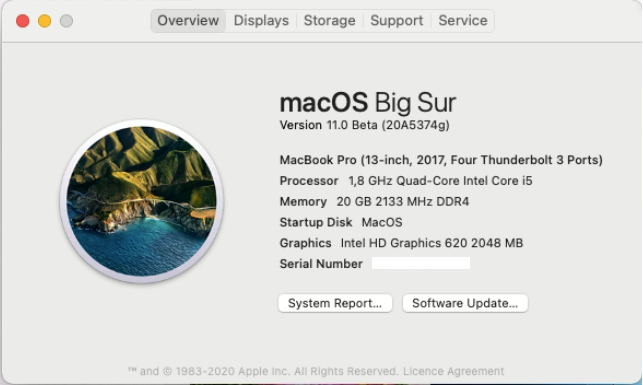

# Acer-Swift-3-SF314-54-2018-MacOS-Big-Sur
Use this OpenCore EFI to run MacOS Big Sur on Acer Swift 3 SF314-54 (2018) 

## Configuration

| Specifications | Detail                                                  |
| ------------------- | ------------------------------------------- |
| Computer model      | Acer Swift 3 SF314-54 (2018)      |
| Processor           | Intel Core i5-8250U     |
| Memory              | 8GB/20GB  DDR4 2400MHz              |
| Hard Disk           | Only tested with SATA SSD    |
| Integrated Graphics | Intel UHD Graphics 620                     |
| Monitor             |  FHD 1920x1080 (14 inch) |
| Sound Card          | Realtek ALC256 (layout-id:13)           |
| Wireless Card       | Swapped with a DW1820A                     |
| SD Card Reader      | Realtek                 |

## Current Status

- **Fingerprint sensor** is not working
- **Built-in DMIC** is not working

- Everything else works well

- Mapped screen brightness to Fn + F3 & Fn + F4

- Ensure to edit the config.plist and add valid  PlatformInfo Genertic and SMBIOS values

