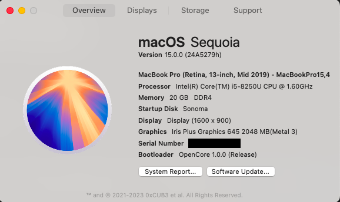

# Acer-Swift-3-SF314-54-2018-MacOS
Use this OpenCore EFI to run MacOS on Acer Swift 3 SF314-54 (2018) 

**Now supporting MacOS Sequoia 15.0 Beta 2 / tested on 4 July 2024 **

## Configuration

| Specifications | Detail                                                  |
| ------------------- | ------------------------------------------- |
| Computer model      | Acer Swift 3 SF314-54 (2018)      |
| Processor           | Intel Core i5-8250U     |
| Memory              | 8GB/20GB  DDR4 2400MHz              |
| Hard Disk           | Only tested with SATA SSD    |
| Integrated Graphics | Intel UHD Graphics 620                     |
| Monitor             | FHD 1920x1080 (14 inch) |
| Sound Card          | Realtek ALC256 (layout-id:13)           |
| Wireless Card       | Swapped with a Intel AX210                    |
| SD Card Reader      | Realtek                 |

## Current Status

- **Fingerprint sensor** is not working
- **Built-in DMIC** is not working

- Everything else works well

- Brightness keys now using new .kext and working 100% with normal brightness keys **F3** and **F4**
  
  You will have to plug in a USB keyboard revert mapping below if previously using the old method

 
- Ensure to edit the **config.plist** and add valid  **PlatformInfo Generic** and **SMBIOS** values

  

- Install **Captin.dmg** to have a Caps Lock indicator on screen

- Install **ComboJack** to assist with Headphones / Headset

- **Apple Watch** unlock is not consitant but seems to be a generic problem on hackintoshes

- **2.4 GHz Wifi interference** with Bluetooth (mostly Bluetooth audio) also seems to be a common problem
